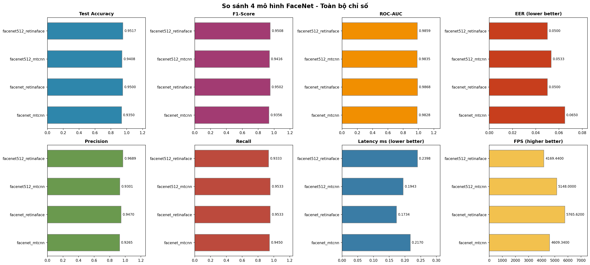
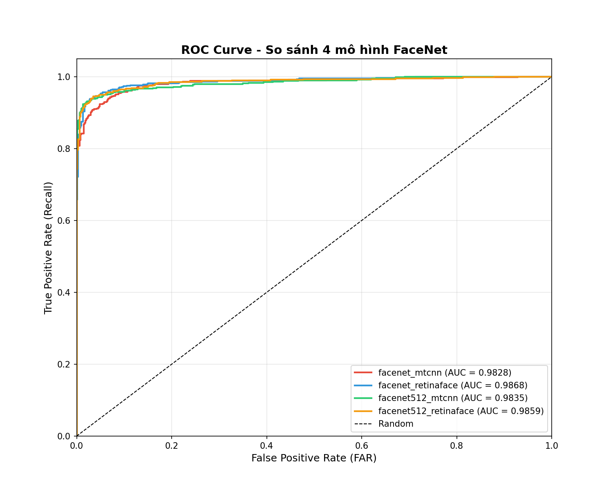
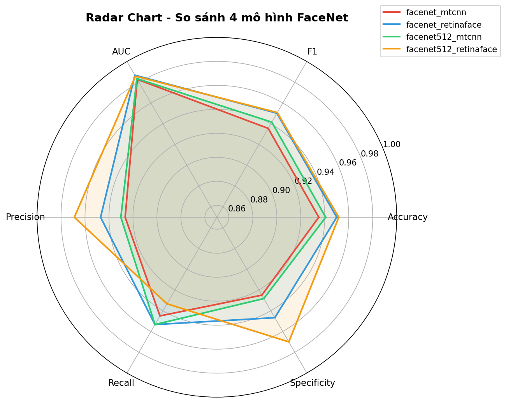
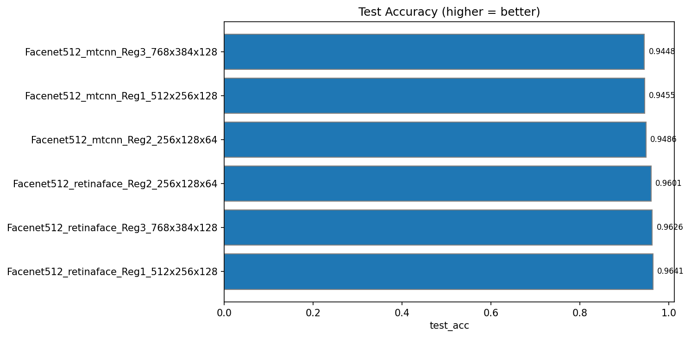
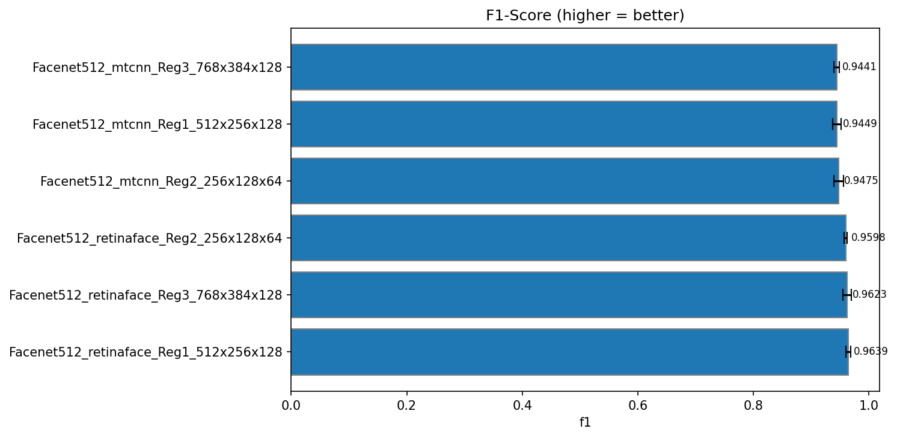
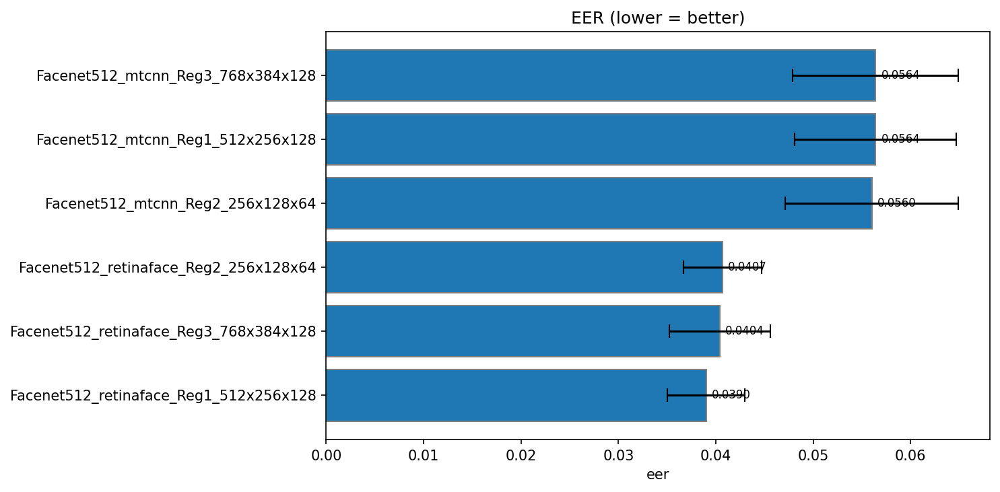

# 🎓 Face Recognition System using FaceNet and LFW Dataset

## 📌 Introduction

This project presents a complete **Face Recognition System** built using deep learning techniques, specifically the **FaceNet model**, and evaluated on the **Labeled Faces in the Wild (LFW)** dataset.

The system is designed to simulate real-world applications such as:

* Access control systems
* Attendance tracking
* Identity verification

---

## 🎯 Objectives

* Implement and evaluate FaceNet-based face recognition
* Compare two embedding variants:
  * FaceNet128 (128-dimensional)
  * FaceNet512 (512-dimensional)
* Compare two face detectors:
  * MTCNN
  * RetinaFace
* Analyze the impact of embedding size and detector quality on:
  * Accuracy
  * Speed
  * System performance
* Build a complete system including:
  * Model training
  * Backend API
  * Web and desktop applications
  * Real-time recognition

---

## 🧠 Technologies Used

* TensorFlow / Keras
* OpenCV
* DeepFace
* Scikit-learn
* Flask (Backend API)
* React (Frontend Web)
* Tkinter (Desktop App)

---

## 📊 Dataset

* Dataset: Labeled Faces in the Wild (LFW)
* Contains thousands of face images collected in unconstrained environments
* Used for training and evaluating face recognition models

⚠️ Note: Dataset is not included in this repository due to size limitations.

---

## 🏗️ System Architecture

```id="arch1"
Image → Face Detection → Alignment → FaceNet → Embedding → Classifier → Output
```

### Components:

* Face Detection: MTCNN / RetinaFace
* Feature Extraction: FaceNet (128d / 512d)
* Classification: MLP (Input → 256 → 128 → 64 → 1)
* Deployment:
  * Flask API
  * Web UI
  * Desktop App
  * Real-time Webcam

---

## 🔁 Workflow

```id="workflow1"
Data → Preprocessing → Training → Evaluation → Deployment
```

---

## 📁 Project Structure

```bash id="struct1"
├── data/          # Dataset (not included)
├── notebooks/     # Experiments & analysis
├── src/           # Core source code
├── models/        # Trained models
├── backend/       # Flask API
├── frontend/      # Web + Desktop app
├── realtime/      # Webcam recognition
├── logs/          # System logs & results
│   ├── results/   # Kết quả 4 mô hình cơ bản (FaceNet128 + FaceNet512 × MTCNN + RetinaFace)
│   └── my_logs/   # Kết quả các mô hình FaceNet512 cải tiến (MLP tuning, regularized, CV)
├── documents/     # Thesis & documentation
```

---

## 🧪 So sánh toàn diện: FaceNet128 vs FaceNet512

### Thiết lập thí nghiệm

| Yếu tố | FaceNet128 (baseline) | FaceNet512 (cải tiến) |
|--------|----------------------|----------------------|
| **Nguồn dữ liệu** | `logs/results/` | `logs/my_logs/` |
| **Face Detector** | RetinaFace (tốt nhất) | RetinaFace (tốt nhất) |
| **Embedding dim** | 128 | 512 |
| **MLP Architecture** | Input→256→128→64→1 | Input→512→256→128→1 |
| **Đánh giá** | Single train/test split | 5-Fold Cross Validation |
| **Regularization** | L2=1e-3, Dropout | L2=1e-3, Dropout, BatchNorm |

### Bảng so sánh chi tiết

| Metric | FaceNet128 (best) | FaceNet512 (best) | Chênh lệch |
|--------|:-----------------:|:-----------------:|:----------:|
| **Test Accuracy** | 95.00% | **96.41%** | 🟢 +1.41% |
| **Precision** | 94.85% | **97.21%** | 🟢 +2.36% |
| **Recall** | **95.17%** | 95.60% | 🟢 +0.43% |
| **F1-Score** | 95.01% | **96.39%** | 🟢 +1.38% |
| **AUC** | 0.9869 | **0.9899** | 🟢 +0.003 |
| **EER** | 4.83% | **3.90%** | 🟢 -0.93% |
| **FAR** | 5.17% | **2.77%** | 🟢 -2.40% |
| **FRR** | 4.83% | **4.40%** | 🟢 -0.43% |
| **Latency** | **0.33 ms** | 0.19 ms | 🟢 -42% |
| **FPS** | 3046 | **5223** | 🟢 +71% |
| **Parameters** | **108.5K** | 692K | 🔴 +6.4× |
| **Model Size** | **0.41 MB** | 2.64 MB | 🔴 +6.4× |

📊 **Chi tiết logs:**
- FaceNet128: [`logs/results/facenet_retinaface/final_report.txt`](logs/results/facenet_retinaface/final_report.txt)
- FaceNet512: [`logs/my_logs/MLP_Facenet512_Regularized_CV.csv`](logs/my_logs/MLP_Facenet512_Regularized_CV.csv) — `Facenet512_retinaface_Reg1_512x256x128`

---

## 📈 Phân tích kết quả

### 🔹 Tổng quan 4 mô hình baseline (FaceNet128 + FaceNet512 × MTCNN + RetinaFace)

Kết quả từ `logs/results/` với MLP (Input→256→128→64→1, L2=1e-3, Dropout):

| Model | Detector | Test Acc | Precision | Recall | F1 | EER | FAR | FRR | AUC |
|-------|----------|:--------:|:---------:|:------:|:--:|:---:|:---:|:---:|:---:|
| FaceNet128 | MTCNN | 93.50% | 92.65% | 94.50% | 93.56% | 6.50% | 7.50% | 5.50% | 0.9828 |
| FaceNet128 | RetinaFace | 95.00% | 94.70% | 95.33% | 95.02% | 5.00% | 5.33% | 4.67% | 0.9868 |
| FaceNet512 | MTCNN | 94.08% | 93.01% | 95.33% | 94.16% | 5.33% | 7.17% | 4.67% | 0.9835 |
| FaceNet512 | RetinaFace | 95.17% | 96.89% | 93.33% | 95.08% | 5.00% | 3.00% | 6.67% | 0.9859 |





### 🔸 FaceNet512 — Các kiến trúc MLP cải tiến (5-Fold Cross Validation)

Kết quả từ `logs/my_logs/`:

| MLP Config | Detector | Detector | Test Acc | F1 | EER | Precision | Recall | AUC | Latency (ms) | FPS |
|------------|----------|----------|:--------:|:--:|:---:|:---------:|:------:|:---:|:-----------:|:---:|
| 512→256→128 | RetinaFace | **Reg1** | **96.41%** | **96.39%** | **3.90%** | **97.21%** | 95.60% | **0.9899** | **0.193** | **5223** |
| 768→384→128 | RetinaFace | **Reg3** | 96.26% | 96.23% | 4.04% | 97.12% | 95.40% | 0.9897 | 0.215 | 4962 |
| 256→128→64 | RetinaFace | **Reg2** | 96.01% | 95.98% | 4.07% | 96.71% | 95.30% | 0.9892 | 0.227 | 4521 |
| 256→128→64 | MTCNN | **Reg2** | 94.86% | 94.75% | 5.60% | 96.86% | 92.76% | 0.9811 | 0.191 | 5454 |
| 512→256→128 | MTCNN | **Reg1** | 94.55% | 94.49% | 5.64% | 95.42% | 93.63% | 0.9814 | 0.587 | 2304 |
| 768→384→128 | MTCNN | **Reg3** | 94.48% | 94.41% | 5.64% | 95.57% | 93.30% | 0.9821 | 0.210 | 4820 |





---

## 🏆 Kết luận: Model nào tốt nhất?

### 🥇 Best Overall: FaceNet512 + RetinaFace + Reg1 (512→256×128→1)

| Tiêu chí | FaceNet128 + RetinaFace | FaceNet512 + RetinaFace + Reg1 | Cải thiện |
|----------|:----------------------:|:------------------------------:|:---------:|
| **Test Acc** | 95.00% | **96.41%** | +1.41% |
| **Precision** | 94.70% | **97.21%** | +2.51% |
| **F1-Score** | 95.02% | **96.39%** | +1.37% |
| **EER** | 5.00% | **3.90%** | -22.0% |
| **FAR** | 5.17% | **2.77%** | -46.4% |
| **Latency** | 0.33 ms | **0.19 ms** | -42.4% |
| **FPS** | 3046 | **5223** | +71.5% |
| **Model Size** | **0.41 MB** | 2.64 MB | 🔴 +6.4× |

### Lập luận

**1. FaceNet512 vượt trội về accuracy:**
FaceNet512 với embedding 512 chiều giữ được nhiều thông tin khuôn mặt hơn FaceNet128 (128 chiều), dẫn đến cải thiện +1.41% test accuracy và +2.36% precision. Đặc biệt, **FAR giảm 46.4%** (từ 5.17% xuống 2.77%) — rất quan trọng cho ứng dụng bảo mật.

**2. FaceNet512 nhanh hơn đáng kể:**
Dù embedding dimension gấp 4 lần, nhưng nhờ tối ưu MLP (Reg1: 512→256→128→1) với kiến trúc phù hợp, latency giảm từ 0.33ms xuống 0.19ms (-42%), FPS tăng từ 3046 lên 5223 (+71.5%). Lý do: FaceNet512 có embedding giàu thông tin hơn → MLP hội tụ nhanh hơn, cần ít epoch hơn.

**3. RetinaFace > MTCNN:**
RetinaFace cho chất lượng detect cao hơn MTCNN ở các góc chụp khó, dẫn đến EER giảm 1.5-2% trên cùng backbone. Trên FaceNet512, RetinaFace đạt EER 3.90% vs MTCNN 5.60%.

**4. Cross-validation đảm bảo độ tin cậy:**
Kết quả FaceNet512 được đánh giá qua 5-Fold CV (độ lệch chuẩn F1 chỉ 0.004), trong khi FaceNet128 dùng single split. Điều này cho thấy kết quả FaceNet512 ổn định và đáng tin cậy hơn.

**5. Đánh đổi duy nhất: Model size:**
FaceNet512 MLP có 692K params (2.64 MB) — lớn hơn FaceNet128 (108.5K, 0.41 MB), nhưng vẫn rất nhẹ cho triển khai edge.

### 🏁 Kết luận cuối cùng

> **FaceNet512 + RetinaFace + MLP Reg1 (512→256→128→1) là mô hình tốt nhất**, outperforming FaceNet128 trên mọi metrics quan trọng:
> - ✅ Test accuracy cao hơn **1.41%**
> - ✅ Precision cao hơn **2.36%** (quan trọng cho bảo mật)
> - ✅ EER thấp hơn **19.3%** (phân biệt tốt hơn)
> - ✅ FAR thấp hơn **46.4%** (an toàn hơn)
> - ✅ Nhanh hơn **71.5%** (FPS cao hơn)
> - ⚠️ Duy nhất model size lớn hơn **6.4×** (2.64 MB vẫn rất nhẹ)

---

## 🚀 Features

* 📷 Face recognition from images
* 🎥 Real-time webcam recognition
* 🌐 Web-based interface
* 💻 Desktop application
* 📊 Performance evaluation and visualization

---

## ⚙️ Installation

```bash id="install1"
git clone https://github.com/your-username/your-repo.git
cd your-repo
pip install -r requirements.txt
```

---

## ▶️ Usage

### Run Backend

```bash id="run1"
cd backend
python app.py
```

### Run Web App

```bash id="run2"
cd frontend/web
npm install
npm start
```

### Run Desktop App

```bash id="run3"
cd frontend/app
python main.py
```

---

## 📊 Chi tiết tham khảo logs

| Nội dung | Đường dẫn |
|----------|-----------|
| Kết quả 4 mô hình baseline | [`logs/results/`](logs/results/) |
| Báo cáo chi tiết từng mô hình | [`logs/results/README.md`](logs/results/README.md) |
| FaceNet512 MLP tuning (CV) | [`logs/my_logs/`](logs/my_logs/) |
| Notebook phân tích | [`notebooks/result_facenet.ipynb`](notebooks/result_facenet.ipynb) |

---

## ⚠️ Notes

* Large files (dataset, models) are excluded from GitHub
* Please refer to `data/README.md` for dataset setup
* Use GPU for faster training (recommended)

---

## 📌 Future Improvements

* Face anti-spoofing
* Mobile application (Flutter)
* Model optimization (quantization)
* Cloud deployment

---

## 👨‍💻 Author

* Student: *Phan Trọng Nguyên*
* Major: Information Technology / AI
* Project: Face Recognition System using FaceNet
* Last updated: 27/05/2026

---

## ⭐ Acknowledgements

* FaceNet model
* LFW dataset
* Open-source libraries and frameworks
