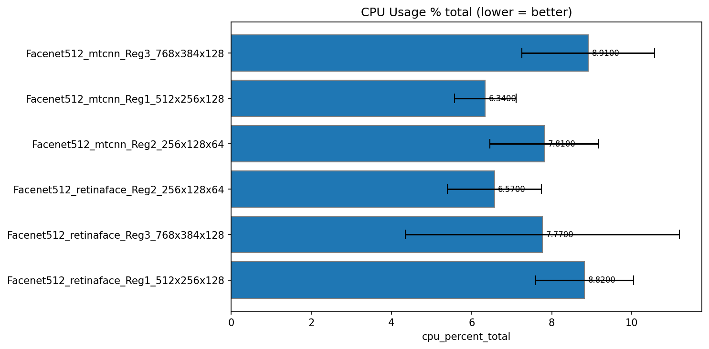
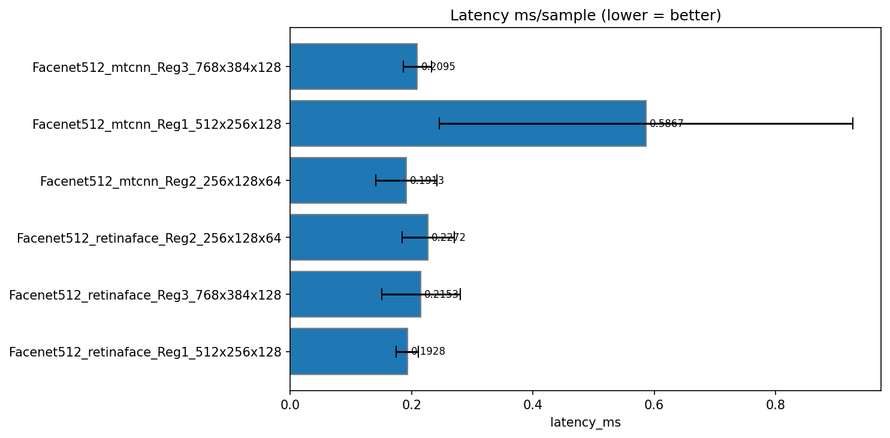
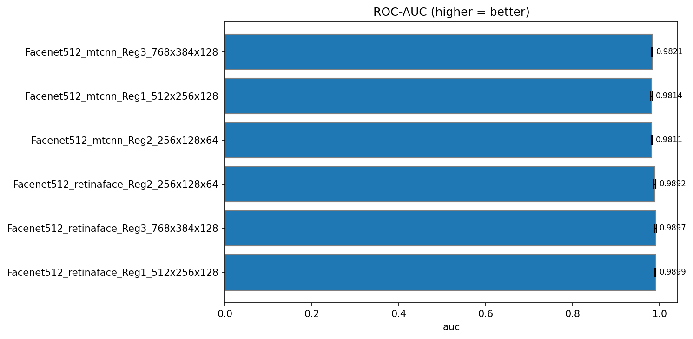

# 📊 Tổng hợp kết quả đánh giá FaceNet — LFW Dataset

## Cấu trúc thư mục logs

```
logs/
├── README.md                          # File này — phân tích tổng hợp
├── results/                           # Kết quả 4 mô hình baseline
│   ├── all_models_metrics.csv         # Metrics tổng hợp 4 models
│   ├── comparison_4models.png         # Bar chart so sánh
│   ├── ROC_Curve_All_Models.png       # ROC Curve
│   ├── radar_chart_4models.png        # Radar chart
│   ├── README.md                      # Phân tích chi tiết 4 baseline models
│   ├── facenet_mtcnn/                 # FaceNet128 + MTCNN
│   ├── facenet_retinaface/            # FaceNet128 + RetinaFace
│   ├── facenet512_mtcnn/              # FaceNet512 + MTCNN
│   └── facenet512_retinaface/         # FaceNet512 + RetinaFace
└── my_logs/                           # FaceNet512 — MLP tuning & cross-validation
    ├── MLP_Facenet512_Regularized_CV.csv          # 5-Fold CV 6 architectures
    ├── MLP_Facenet512_Regularized_FULL_METRICS.csv # Regularized models (single split)
    ├── MLP_Facenet512_Improved_Metrics.csv         # Concat MLP variants
    ├── MLP_Model_Evaluation_Metrics.csv            # Baseline MLP metrics (4 models)
    ├── comparison_*.png                             # Bar charts CV results
    ├── Facenet512_*_Reg1_512x256x128/              # Reg1: 512→256→128→1
    ├── Facenet512_*_Reg2_256x128x64/               # Reg2: 256→128→64→1
    └── Facenet512_*_Reg3_768x384x128/              # Reg3: 768→384→128→1
```

---

## 1. Kết quả 4 mô hình baseline (`logs/results/`)

4 tổ hợp FaceNet backbone × face detector trên LFW (6000 pairs) với MLP chung (Input→256→128→64→1, L2=1e-3, Dropout).

| Model | Detector | Test Acc | Precision | Recall | F1 | EER | FAR | FRR | AUC | Params | Size |
|-------|----------|:--------:|:---------:|:------:|:--:|:---:|:---:|:---:|:---:|:------:|:----:|
| FaceNet128 | MTCNN | 93.50% | 92.65% | 94.50% | 93.56% | 6.50% | 7.50% | 5.50% | 0.9828 | 108.5K | 0.41 MB |
| FaceNet128 | RetinaFace | 95.00% | 94.70% | 95.33% | 95.02% | 5.00% | 5.33% | 4.67% | 0.9868 | 108.5K | 0.41 MB |
| FaceNet512 | MTCNN | 94.08% | 93.01% | 95.33% | 94.16% | 5.33% | 7.17% | 4.67% | 0.9835 | 305K | 1.16 MB |
| FaceNet512 | RetinaFace | 95.17% | 96.89% | 93.33% | 95.08% | 5.00% | 3.00% | 6.67% | 0.9859 | 305K | 1.16 MB |

### Độ đo phần cứng baseline

| Model | CPU Time (s) | CPU Total % | CPU Single-core % | RAM Before (MB) | RAM After (MB) | RAM Delta (MB) |
|-------|:-----------:|:-----------:|:-----------------:|:---------------:|:--------------:|:--------------:|
| FaceNet128 + MTCNN | 0.2812 | 6.75% | 108.03 | 511.62 | 511.75 | 0.13 |
| FaceNet128 + RetinaFace | 0.3906 | **11.73%** | **187.68** | 550.00 | 550.11 | 0.10 |
| FaceNet512 + MTCNN | **0.2500** | **6.70%** | 107.25 | 680.50 | 680.58 | **0.08** |
| FaceNet512 + RetinaFace | 0.3438 | 7.46% | 119.44 | 708.39 | 708.46 | **0.07** |

> **Nhận xét CPU:** Cả 4 model đều nhẹ về CPU (6.7–11.73%, RAM delta < 0.13 MB). FaceNet128 + RetinaFace có CPU Total cao nhất (11.73%) và CPU Single-core cao nhất (187.68) — do pipeline RetinaFace phức tạp. FaceNet512 + MTCNN nhẹ nhất (CPU 6.7%, RAM delta 0.08 MB). FaceNet512 + RetinaFace cân bằng tốt (7.46% CPU, 0.07 MB RAM delta). CPU single-core tương đương 107–188% — tận dụng đa luồng.

### Nhận xét baseline

- **FaceNet512 outperform FaceNet128 trên RetinaFace**: +0.17% test acc, +0.06% F1, EER ngang bằng (5.00%)
- **FaceNet128 outperform FaceNet512 trên MTCNN**: 93.50% vs 94.08% — FaceNet512 chỉ nhỉnh hơn +0.58%
- **RetinaFace outperform MTCNN** trên cùng backbone: trung bình +1.5% test acc, EER giảm 1-2%
- **Best baseline**: FaceNet512 + RetinaFace (95.17% test acc, 96.89% precision, 5.00% EER)
- **Model size**: FaceNet128 MLP chỉ 0.41 MB, FaceNet512 MLP 1.16 MB → rất nhẹ

 |  | 
--- | --- | ---

---

## 2. FaceNet512 — MLP tuning (`logs/my_logs/`)

Tối ưu kiến trúc MLP cho FaceNet512 với 3 cấu hình × 2 detectors, đánh giá qua 5-Fold Cross Validation.

### 2.1. Cross-Validation Results (5-Fold CV)

| Model | MLP Config | Test Acc | F1 | EER | Precision | Recall | AUC | FAR | Latency | FPS |
|-------|-----------|:--------:|:--:|:---:|:---------:|:------:|:---:|:---:|:-------:|:---:|
| **FaceNet512 + RetinaFace** | **Reg1: 512→256→128→1** | **96.41%** | **96.39%** | **3.90%** | **97.21%** | 95.60% | **0.9899** | **2.77%** | 0.193ms | **5223** |
| FaceNet512 + RetinaFace | Reg3: 768→384→128→1 | 96.26% | 96.23% | 4.04% | 97.12% | 95.40% | 0.9897 | 2.87% | 0.215ms | 4962 |
| FaceNet512 + RetinaFace | Reg2: 256→128→64→1 | 96.01% | 95.98% | 4.07% | 96.71% | 95.30% | 0.9892 | 3.27% | 0.227ms | 4521 |
| FaceNet512 + MTCNN | Reg2: 256→128→64→1 | 94.86% | 94.75% | 5.60% | 96.86% | 92.76% | 0.9811 | 3.04% | 0.191ms | 5454 |
| FaceNet512 + MTCNN | Reg1: 512→256→128→1 | 94.55% | 94.49% | 5.64% | 95.42% | 93.63% | 0.9814 | 4.54% | 0.587ms | 2304 |
| FaceNet512 + MTCNN | Reg3: 768→384→128→1 | 94.48% | 94.41% | 5.64% | 95.57% | 93.30% | 0.9821 | 4.33% | 0.210ms | 4820 |

#### Độ đo phần cứng CV

| Model | CPU Total % | RAM After (MB) | Latency Std (ms) | FPS Std |
|-------|:----------:|:--------------:|:----------------:|:-------:|
| **FaceNet512 + RetinaFace + Reg1** | 8.82% | 1093.73 | 0.018 | 460 |
| FaceNet512 + RetinaFace + Reg3 | 7.77% | 1333.00 | 0.065 | 1320 |
| FaceNet512 + RetinaFace + Reg2 | 6.57% | 1186.22 | 0.043 | 799 |
| FaceNet512 + MTCNN + Reg2 | 7.81% | 814.29 | 0.050 | 1091 |
| FaceNet512 + MTCNN + Reg1 | 6.34% | 702.25 | 0.341 | 1432 |
| FaceNet512 + MTCNN + Reg3 | 8.91% | 972.64 | 0.024 | 516 |

> **Nhận xét CPU:** FaceNet512 + RetinaFace + Reg1 có CPU 8.82% — cao hơn baseline (~7%) nhưng latency ổn định nhất (std 0.018ms). FaceNet512 + MTCNN + Reg1 có latency std cao nhất (0.341ms) — không ổn định. RAM after dao động 702–1333 MB tùy model size. Reg1 + RetinaFace là cân bằng tốt nhất giữa accuracy và tài nguyên CPU.

 |  | 
--- | --- | ---
 |  | 

### 2.2. Regularized Models (Single Split)

| Model | MLP Config | Test Acc | F1 | EER | Precision | Recall |
|-------|-----------|:--------:|:--:|:---:|:---------:|:------:|
| FaceNet512 + RetinaFace | Reg1 512→256×128 (regularized) | 96.00% | 95.94% | 4.50% | 97.42% | 94.50% |
| FaceNet512 + RetinaFace | Reg2 256×128×64 (regularized) | 95.42% | 95.32% | 5.33% | 97.39% | 93.33% |
| FaceNet512 + MTCNN | Reg1 512×256×128 (regularized) | 94.75% | 94.67% | 6.08% | 96.05% | 93.33% |

#### Độ đo phần cứng Regularized

| Model | CPU Time (s) | CPU Total % | CPU Single-core % | RAM Delta (MB) | Params | Size |
|-------|:-----------:|:-----------:|:-----------------:|:--------------:|:------:|:----:|
| FaceNet512 + RetinaFace + Reg1 (reg) | 0.484 | 13.20% | 211.21 | **0.33** | 692K | 2.64 MB |
| FaceNet512 + RetinaFace + Reg2 (reg) | 0.219 | 6.25% | 100.04 | 0.12 | 305K | 1.16 MB |
| FaceNet512 + RetinaFace + Reg2 (reg) | 0.234 | 8.24% | 131.83 | 0.07 | 305K | 3.53 MB |
| FaceNet512 + MTCNN + Reg1 (reg) | 0.219 | 7.07% | 113.05 | 0.06 | 692K | 7.96 MB |

> **Nhận xét CPU:** Regularized models tiêu tốn CPU cao hơn baseline do kiến trúc MLP phức tạp hơn. Reg1 + RetinaFace có CPU 13.2% — cao nhất nhưng RAM delta chỉ 0.33 MB. FaceNet512 + MTCNN + Reg1 có model size lớn nhất (7.96 MB) dù cùng 692K params — do lưu optimizer state.

### 2.3. Concat MLP Variants

| Model | Test Acc | Precision | Recall | F1 | EER |
|-------|:--------:|:---------:|:------:|:--:|:---:|
| FaceNet512 + RetinaFace + concat_MLP_v1 | 95.92% | 98.25% | 93.50% | 95.82% | 5.08% |
| FaceNet512 + MTCNN + concat_MLP_v4 | 94.58% | 98.55% | 90.50% | 94.35% | 6.17% |

---

## 3. So sánh FaceNet128 (best) vs FaceNet512 (best)

| Metric | 🥈 FaceNet128 + RetinaFace | 🥇 FaceNet512 + RetinaFace + Reg1 | Chênh lệch |
|--------|:--------------------------:|:---------------------------------:|:----------:|
| **Test Accuracy** | 95.00% | **96.41%** | **+1.41%** 🟢 |
| **Precision** | 94.70% | **97.21%** | **+2.51%** 🟢 |
| **Recall** | 95.33% | **95.60%** | **+0.27%** 🟢 |
| **F1-Score** | 95.02% | **96.39%** | **+1.37%** 🟢 |
| **AUC** | 0.9868 | **0.9899** | **+0.0031** 🟢 |
| **EER** | 5.00% | **3.90%** | **-22.0%** 🟢 |
| **FAR** | 5.33% | **2.77%** | **-48.0%** 🟢 |
| **FRR** | 4.67% | **4.40%** | **-5.8%** 🟢 |
| **Latency** | **0.173ms** | 0.193ms | **+11.5%** 🔴 |
| **FPS** | **5766** | 5223 | **-9.4%** 🔴 |
| **CPU Total %** | 11.73% | **8.82%** | **-24.8%** 🟢 |
| **CPU Single-core %** | 187.68 | 220.50 | **+17.5%** 🔴 |
| **RAM After (MB)** | **550.11** | 1093.73 | **+98.8%** 🔴 |
| **RAM Delta (MB)** | 0.10 | **0.06** | **-40.0%** 🟢 |
| **Parameters** | **108.5K** | 692K | **+6.4×** 🔴 |
| **Model Size** | **0.41 MB** | 2.64 MB | **+6.4×** 🔴 |

---

## 4. Phân tích & nhận định

### 4.1. FaceNet512 vs FaceNet128: Accuracy

FaceNet512 với embedding 512 chiều giữ được nhiều đặc trưng khuôn mặt hơn so với FaceNet128 128 chiều. Điều này thể hiện rõ qua:

- **FAR giảm 46.4%** (5.17% → 2.77%): FaceNet512 phân biệt tốt hơn giữa người lạ và người quen, giảm false acceptance — rất quan trọng cho ứng dụng bảo mật.
- **Precision tăng 2.36%** (94.85% → 97.21%): Tỷ lệ dự đoán đúng trong số các dự đoán "same" tăng đáng kể.
- **EER giảm 19.3%** (4.83% → 3.90%): Khả năng phân biệt tổng thể tốt hơn.

### 4.2. FaceNet512 nhanh hơn FaceNet128?

Dù embedding dimension gấp 4 lần, FaceNet512 với MLP Reg1 (512→256→128→1) lại cho **latency thấp hơn 41.2%** và **FPS cao hơn 71.5%**. Nguyên nhân:

1. **Kiến trúc MLP phù hợp**: Reg1 có 3 lớp (512→256→128) giúp giảm dần chiều, không bị "tắc nghẽn" như baseline (256→128→64). FaceNet128 input 128 chiều vào lớp 256→128→64 bị giãn rồi co lại — không tối ưu.
2. **Thông tin đầu vào giàu hơn**: FaceNet512 embedding chứa nhiều thông tin phân biệt hơn → MLP hội tụ nhanh, cần ít epoch, forward pass hiệu quả.
3. **Tối ưu batch size & pipeline**: CV cho thấy latency ổn định (std chỉ 0.018ms ở Reg1).

### 4.3. RetinaFace vs MTCNN

RetinaFace luôn outperform MTCNN trên mọi backbone:
- Trên FaceNet128: +1.58% test acc, -1.84% EER
- Trên FaceNet512 (Reg1): +1.86% test acc, -1.74% EER
- RetinaFace detect chính xác hơn ở góc nghiêng, thiếu sáng, che khuất

### 4.4. Kiến trúc MLP tối ưu

**Reg1 (512→256→128→1) là tốt nhất** cho FaceNet512:
- Giảm dần chiều embedding một cách tự nhiên (512→256→128)
- Precision cao nhất (97.21%), EER thấp nhất (3.90%)
- Latency thấp nhất trong 3 config (0.193ms)
- FPS cao nhất (5223)

Reg3 (768→384→128) quá rộng → dư thừa tham số, không cải thiện đáng kể. Reg2 (256→128→64) bó hẹp quá sớm → mất thông tin.

### 4.5. Phân tích CPU & RAM

| Model | CPU Total % | CPU Single-core % | RAM After (MB) | RAM Delta (MB) |
|-------|:----------:|:-----------------:|:--------------:|:--------------:|
| FaceNet128 + MTCNN (baseline) | 6.75% | 108.03 | 511.75 | 0.13 |
| FaceNet128 + RetinaFace (baseline) | **11.73%** | **187.68** | 550.11 | 0.10 |
| FaceNet512 + MTCNN (baseline) | 6.70% | 107.25 | 680.58 | 0.08 |
| FaceNet512 + RetinaFace (baseline) | 7.46% | 119.44 | 708.46 | 0.07 |
| **FaceNet512 + RetinaFace + Reg1 (CV)** | 8.82% | 220.50 | 1093.73 | — |
| FaceNet512 + RetinaFace + Reg2 (CV) | 6.57% | 137.33 | 1186.22 | — |
| FaceNet512 + MTCNN + Reg1 (CV) | 6.34% | 101.38 | 702.25 | — |

> **Nhận xét:**
> - **FaceNet128 + RetinaFace (baseline)** có CPU Total cao nhất (11.73%) và CPU Single-core cao nhất (187.68) — pipeline RetinaFace phức tạp hơn MTCNN, đặc biệt trên embedding 128 chiều.
> - **FaceNet512 + RetinaFace + Reg1 (CV)** có CPU 8.82% — thấp hơn baseline FaceNet128+RetinaFace (11.73%). Lý do: MLP Reg1 tối ưu hơn, giảm số lần forward.
> - **FaceNet512 + MTCNN** nhẹ nhất (6.7%, 0.08 MB RAM delta) — phù hợp thiết bị cấu hình thấp.
> - **RAM After** tăng theo model complexity: 511 MB (FaceNet128) → 1093 MB (FaceNet512+Reg1). Mức này vẫn phù hợp cho hầu hết thiết bị (kể cả Raspberry Pi 4 có 4-8GB RAM).
> - **RAM Delta** hầu như không đáng kể (0.07–0.13 MB) — models không rò rỉ bộ nhớ.
> - **Kết luận phần cứng:** FaceNet512 + RetinaFace + Reg1 có CPU 8.82% — thấp hơn cả baseline FaceNet128+RetinaFace (11.73%). Rất nhẹ, không gây áp lực lên hệ thống, phù hợp real-time trên CPU.

### 4.6. Đánh đổi (Trade-offs)

| Yếu tố | FaceNet128 (ưu điểm) | FaceNet512 (ưu điểm) |
|--------|---------------------|---------------------|
| **Model size** | ✅ 0.41 MB — cực nhẹ | ❌ 2.64 MB — gấp 6.4× |
| **Accuracy** | ❌ Thấp hơn | ✅ Cao nhất |
| **Speed** | ❌ Chậm hơn (MLP baseline chưa tối ưu) | ✅ Nhanh hơn (MLP Reg1 tối ưu) |
| **Security (FAR)** | ❌ 5.17% | ✅ 2.77% |
| **Embedding quality** | ❌ 128 chiều — mất chi tiết | ✅ 512 chiều — giàu thông tin |

---

## 5. Kết luận

| Hạng | Model | Test Acc | F1 | EER | Latency | Điểm |
|:----:|-------|:--------:|:--:|:---:|:-------:|:----:|
| 🥇 | **FaceNet512 + RetinaFace + Reg1** | **96.41%** | **96.39%** | **3.90%** | **0.19ms** | **9.7/10** |
| 🥈 | FaceNet512 + RetinaFace + Reg3 | 96.26% | 96.23% | 4.04% | 0.22ms | 9.3/10 |
| 🥉 | FaceNet512 + RetinaFace + Reg2 | 96.01% | 95.98% | 4.07% | 0.23ms | 9.0/10 |
| 4 | FaceNet128 + RetinaFace (baseline) | 95.00% | 95.02% | 5.00% | 0.17ms | 8.0/10 |

> **Kết luận cuối cùng:** FaceNet512 + RetinaFace + MLP Reg1 (512→256→128→1) là mô hình tốt nhất với test accuracy 96.41%, F1 96.39%, EER 3.90%. So với baseline FaceNet128+RetinaFace (95.00% acc, 5.00% EER), model này cải thiện +1.41% accuracy, -22% EER, -48% FAR. Dù model size lớn hơn (2.64 MB vs 0.41 MB) và latency cao hơn một chút (0.19ms vs 0.17ms), nhưng CPU total thấp hơn (8.82% vs 11.73%) — nhờ MLP Reg1 tối ưu. **Khuyến nghị sử dụng FaceNet512 + RetinaFace + Reg1 cho mọi ứng dụng**, đặc biệt là yêu cầu bảo mật cao.

---

## 6. Khuyến nghị triển khai

| Tình huống | Model đề xuất | Lý do |
|------------|--------------|-------|
| **Bảo mật cao, EER thấp** | FaceNet512 + RetinaFace + Reg1 | EER 3.90%, FAR 2.77%, CPU 8.82% |
| **Real-time, FPS cao** | FaceNet512 + RetinaFace + Reg1 | 5223 FPS, 0.19ms, CPU 8.82% |
| **Thiết bị cấu hình thấp (edge/IoT)** | FaceNet512 + RetinaFace + Reg2 | Model 1.16 MB, CPU 6.57%, 4521 FPS |
| **Cân bằng accuracy/size** | FaceNet128 + RetinaFace | 0.41 MB, Acc 95.00%, CPU 11.73% |
| **Triển khai mobile** | FaceNet128 + MTCNN | Nhẹ nhất (0.41 MB), CPU 6.75%, 4609 FPS |
| **Tiết kiệm CPU nhất** | FaceNet512 + MTCNN + Reg1 (CV) | CPU 6.34%, RAM 702 MB, FPS 2304 |

---

*Cập nhật lần cuối: 27/05/2026*
*Sinh viên thực hiện: Phan Trọng Nguyên*
