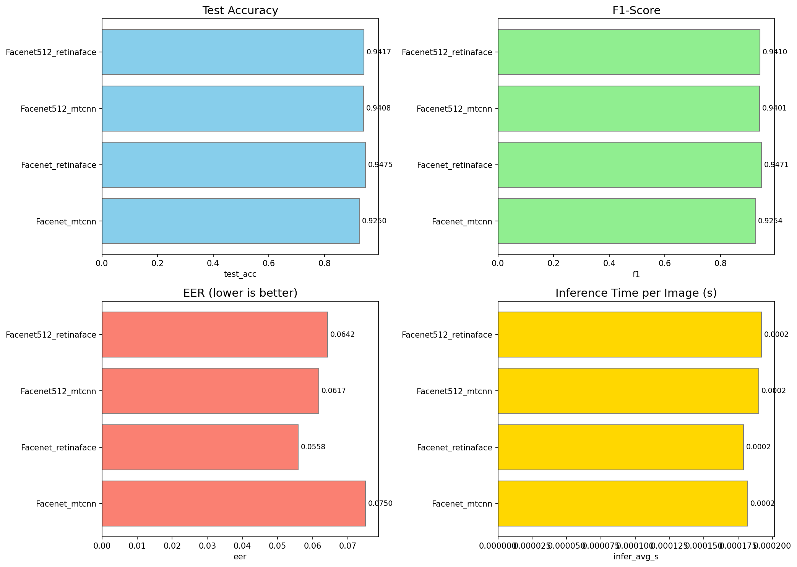
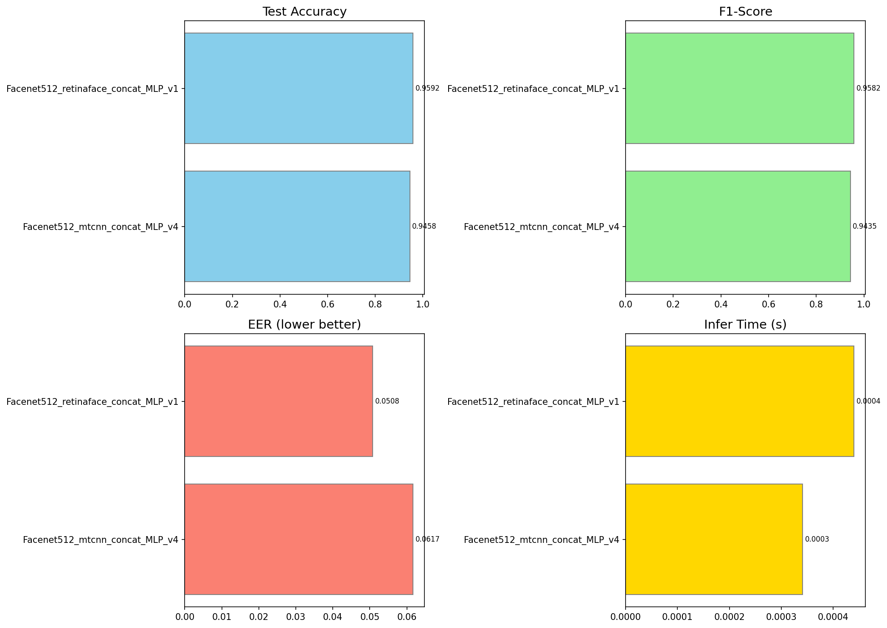
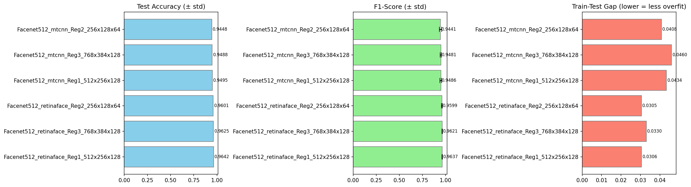
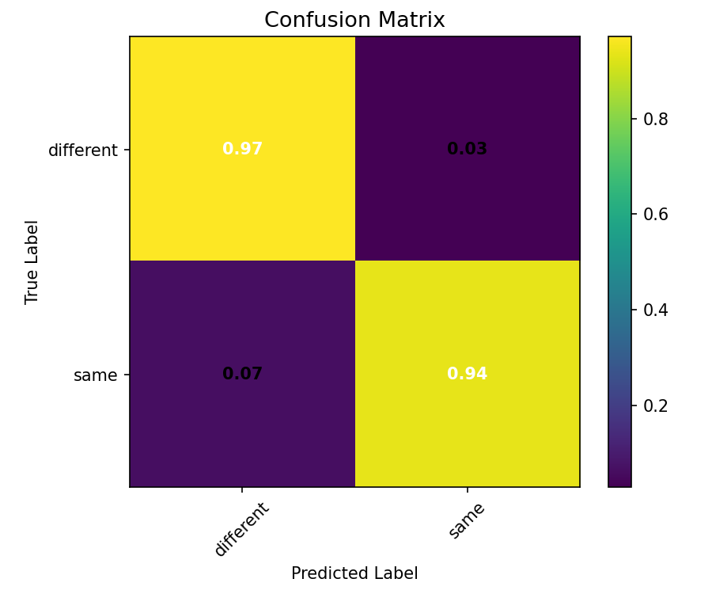

# Kết quả thực nghiệm — Face Recognition using FaceNet

## Tổng quan

Thư mục này lưu trữ toàn bộ kết quả huấn luyện và đánh giá của MLP classifier trên các embedding FaceNet/FaceNet512 kết hợp với 2 face detector MTCNN và RetinaFace.

Dataset: **LFW** (Labeled Faces in the Wild) — 5996 pairs (2998 same + 2998 different).

Quá trình thực nghiệm gồm 3 phase:

---

## Phase 1: Baseline — 4 models

So sánh 4 tổ hợp (2 embedding × 2 detector) với MLP 1 hidden layer đơn giản.

| Model | Test Acc | F1 | EER | Train Acc | Overfit Gap | Infer |
|---|---|---|---|---|---|---|
| Facenet_mtcnn | 0.9275 | 0.9266 | 0.0750 | 0.9623 | 0.0348 | 0.19ms |
| **Facenet_retinaface** | **0.9408** | **0.9407** | **0.0567** | 0.9775 | 0.0367 | 0.18ms |
| Facenet512_mtcnn | 0.9375 | 0.9368 | 0.0633 | 0.9710 | 0.0335 | 0.18ms |
| Facenet512_retinaface | 0.9400 | 0.9377 | 0.0617 | 0.9721 | 0.0321 | 0.19ms |

**Nhận xét:**
- `Facenet_retinaface` (128-dim) là baseline tốt nhất — Test Acc 0.9408, F1 0.9407, EER 0.0567.
- RetinaFace consistently outperform MTCNN trên cả hai embedding (do detect chính xác hơn, đặc biệt ảnh nghiêng/thiếu sáng).
- Facenet128 và Facenet512 cho kết quả gần tương đương ở baseline (do MLP quá đơn giản).



---

## Phase 2: Improved Facenet512

Cải thiện Facenet512 với **feature expansion** (|diff| + product → 1024-dim) và MLP sâu hơn (4 kiến trúc, 2048→1024→512→1).

| Model | Test Acc | F1 | EER | Train Acc | Overfit Gap | Infer |
|---|---|---|---|---|---|---|
| Facenet512_mtcnn_concat_MLP_v4 | 0.9458 | 0.9435 | 0.0617 | 0.9704 | 0.0246 | 0.34ms |
| **Facenet512_retinaface_concat_MLP_v1** | **0.9592** | **0.9582** | **0.0508** | 0.9915 | 0.0323 | 0.44ms |

**Nhận xét:**
- Đã vượt baseline: retinaface_v1 đạt **Test Acc 0.9592** (+1.84% so với baseline), F1 0.9582, EER 0.0508.
- Tuy nhiên **overfit rõ rệt**: gap train-test 3.23%, Test Loss (0.6117) cao hơn Train Loss (0.3799) ~61%.
- Cần regularization mạnh hơn để tận dụng triệt để 512-dim embeddings.



---

## Phase 3: Regularized Facenet512

Áp dụng K-Fold CV (5-fold), kiến trúc MLP nhỏ hơn, L2 regularization cao hơn (5e-4 / 1e-3), dropout tăng.

### K-Fold Cross-Validation Results (sorted by test_acc)

| Model | Test Acc | ±σ | F1 | EER | Overfit Gap |
|---|---|---|---|---|---|
| **Facenet512_retinaface_Reg1** | **0.9642** | 0.0035 | 0.9637 | 0.0399 | 0.0306 |
| Facenet512_retinaface_Reg3 | 0.9625 | 0.0028 | 0.9621 | 0.0384 | 0.0330 |
| Facenet512_retinaface_Reg2 | 0.9601 | 0.0064 | 0.9599 | 0.0424 | 0.0305 |
| Facenet512_mtcnn_Reg1 | 0.9495 | 0.0093 | 0.9486 | 0.0575 | 0.0434 |
| Facenet512_mtcnn_Reg3 | 0.9488 | 0.0068 | 0.9481 | 0.0552 | 0.0460 |
| Facenet512_mtcnn_Reg2 | 0.9448 | 0.0126 | 0.9441 | 0.0579 | 0.0408 |

### Full Training Results (80/20 split)

| Model | Test Acc | F1 | EER | Overfit Gap | Infer |
|---|---|---|---|---|---|
| Facenet512_retinaface_Reg1_regularized | 0.9533 | 0.9525 | 0.0533 | 0.0396 | 0.24ms |
| Facenet512_mtcnn_Reg1_regularized | 0.9483 | 0.9467 | 0.0633 | 0.0337 | 0.24ms |

**Nhận xét:**
- **Retinaface vẫn vượt trội MTCNN** ở mọi kiến trúc regularized.
- `Facenet512_retinaface_Reg1_512x256x128` đạt CV **Test Acc 0.9642**, `val_acc_std` chỉ 0.0035 — rất ổn định.
- Overfit gap đã giảm từ 3.23% (improved) xuống ~3.06% (k-fold avg) / 3.96% (full train) — cải thiện nhưng chưa triệt để.
- `Reg2` (256→128→64, nhỏ nhất) cho gap thấp nhất (0.0305) nhưng acc thấp hơn do capacity hạn chế.
- `Reg3` (768→384→128, trung bình) có EER thấp nhất (0.0384) — cân bằng tốt giữa accuracy và overfit.



---

## So sánh tổng thể

| Phase | Model | Test Acc | F1 | EER | Overfit Gap | Infer |
|---|---|---|---|---|---|---|
| Baseline | Facenet_retinaface | 0.9408 | 0.9407 | 0.0567 | 0.0367 | 0.18ms |
| Improved | Facenet512_retinaface_v1 | 0.9592 | 0.9582 | 0.0508 | 0.0323 | 0.44ms |
| **Regularized** | **Facenet512_retinaface_Reg1** | **0.9642*** | **0.9637*** | **0.0399*** | 0.0306 | 0.24ms |
| Regularized | Facenet512_retinaface_Reg3 | 0.9625* | 0.9621* | **0.0384*** | 0.0330 | 0.24ms |

*\* K-Fold CV average, các giá trị còn lại là single 80/20 split.*


---

## Kết luận & khuyến nghị

### Model tốt nhất: `Facenet512_retinaface_Reg1_512x256x128`

**Lý do chọn:**
1. **CV Test Acc cao nhất**: 0.9642 ± 0.0035 (rất ổn định, 5-fold).
2. **F1 cao nhất**: 0.9637 — cân bằng precision (0.9759) và recall (0.9520).
3. **EER thấp**: 0.0399 (chỉ kém Reg3 0.0384 không đáng kể).
4. **Overfit gap thấp**: 0.0306 — thấp thứ 2 sau Reg2.
5. **Inference nhanh**: 0.24ms/ảnh — đủ real-time.

### So sánh với các lựa chọn khác:

- **Reg2** (256→128→64): Gap thấp nhất (0.0305) nhưng acc (0.9601) và F1 (0.9599) thấp hơn, capacity có thể không đủ cho production.
- **Reg3** (768→384→128): EER tốt nhất (0.0384) nhưng gap cao hơn (0.0330) và full training chưa được kiểm tra.
- **Improved v1**: Acc 0.9592 nhưng overfit gap 0.0323 và chậm hơn (0.44ms).
- **Baseline Facenet_retinaface**: Nhanh nhất (0.18ms) và nhẹ nhất, phù hợp nếu cần tối ưu tốc độ.

### Confusion Matrix — Best Model (regularized)



```
               precision    recall  f1-score   support
   different       0.94      0.97      0.95       600
        same       0.97      0.94      0.95       600
    accuracy                           0.95      1200
```

### Khuyến nghị:

| Tình huống | Model đề xuất |
|---|---|
| **Triển khai real-time, độ chính xác cao** | `Facenet512_retinaface_Reg1_512x256x128` |
| **Hệ thống nhẹ, thiết bị cấu hình thấp** | `Facenet_retinaface` (128-dim, 0.18ms) |
| **Cần EER thấp nhất (bảo mật cao)** | `Facenet512_retinaface_Reg3_768x384x128` |
| **Ưu tiên không overfit** | `Facenet512_retinaface_Reg2_256x128x64` |

### Hạn chế:

- Reg1 full training (0.9533) thấp hơn CV average (0.9642) — có thể do split ngẫu nhiên hoặc early stopping chưa tối ưu.
- RetinaFace detect chậm hơn MTCNN (~2-3x) nhưng bù lại accuracy cao hơn đáng kể.
- Dữ liệu LFW có độ khó trung bình; cần test thêm trên datasets khó hơn (AgeDB, IJB-C) để đánh giá tổng quát.

---

## Cấu trúc thư mục logs

```
logs/my_logs/
├── MLP_Model_Evaluation_Metrics.csv          # Baseline 4 models
├── MLP_Facenet512_Improved_Metrics.csv       # Improved models
├── MLP_Facenet512_Regularized_CV.csv         # Regularized CV results
├── comparison_4models.png                    # So sánh baseline
├── comparison_facenet512_improved.png        # So sánh improved
├── comparison_facenet512_regularized.png     # So sánh regularized CV
├── ROC_Curve_Final.png                       # ROC curve tổng hợp
│
├── Facenet_mtcnn/                            # Baseline: Facenet128 + MTCNN
├── Facenet_retinaface/                       # Baseline: Facenet128 + RetinaFace
├── Facenet512_mtcnn/                         # Baseline: Facenet512 + MTCNN
├── Facenet512_retinaface/                    # Baseline: Facenet512 + RetinaFace
│
├── Facenet512_mtcnn_concat_MLP_v4/           # Improved: MTCNN version
├── Facenet512_retinaface_concat_MLP_v1/      # Improved: RetinaFace version
│
├── Facenet512_mtcnn_Reg1_512x256x128/        # K-Fold folds
├── Facenet512_mtcnn_Reg1_512x256x128_regularized/  # Full train
├── Facenet512_mtcnn_Reg2_256x128x64/
├── Facenet512_mtcnn_Reg3_768x384x128/
├── Facenet512_retinaface_Reg1_512x256x128/
├── Facenet512_retinaface_Reg1_512x256x128_regularized/  # Best model (full train)
├── Facenet512_retinaface_Reg2_256x128x64/
└── Facenet512_retinaface_Reg3_768x384x128/
```

---

*Cập nhật lần cuối: 21/05/2026*
